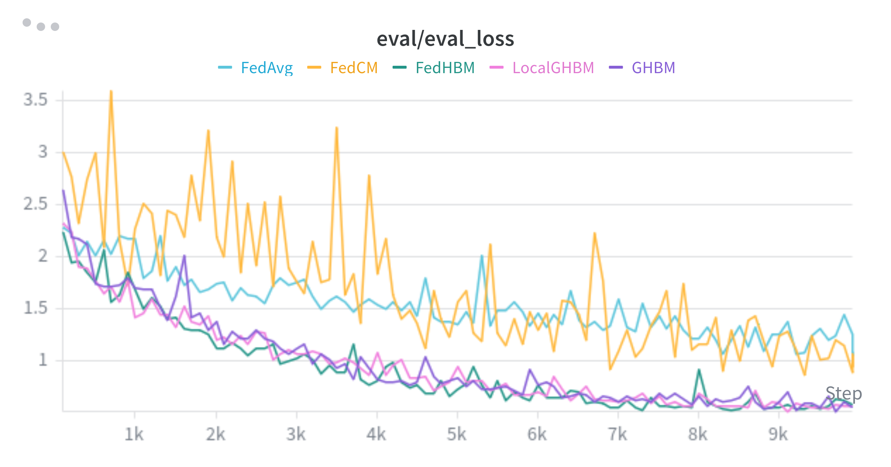
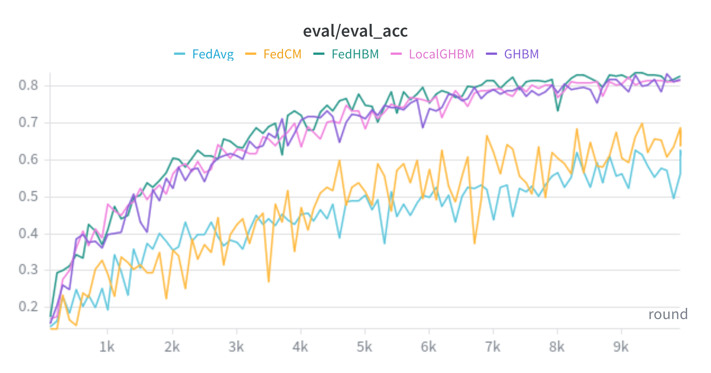
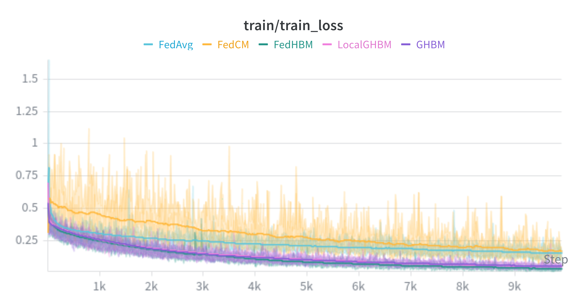

# Communication-Efficient Heterogeneous Federated Learning with Generalized Heavy-Ball Momentum

**Paper:** [OpenReview page](https://openreview.net/forum?id=LNoFjcLywb)

**Authors:** Riccardo Zaccone, Sai Praneeth Karimireddy, Carlo Masone, Marco Ciccone

**Abstract:** Federated learning has emerged as a strong approach for learning from decentralized data in privacy-constrained settings, but its practical adoption is limited by data heterogeneity and partial client participation. This work shows that existing momentum methods in FL become biased toward recently sampled clients, which explains why they often fail to outperform FedAvg in large-scale heterogeneous settings. The paper introduces Generalized Heavy-Ball Momentum (GHBM), proves convergence under unbounded heterogeneity in cyclic partial participation, and presents adaptive communication-efficient variants that match FedAvg’s communication complexity when clients can be stateful. Extensive experiments on vision and language tasks show improved robustness and stronger performance than prior FL baselines in difficult heterogeneous regimes.


## About this baseline

**What’s implemented:** This baseline reproduces the core CIFAR image-classification setup of the paper for the `ghbm`, `localghbm`, and `fedhbm` algorithms, and also includes `fedavg` plus a `fedcm` reproduction launcher for side-by-side comparison. It focuses on the federated optimization loop, the client update rule, and the data partitioning regime used for CIFAR experiments.

**Datasets:** CIFAR-10 and CIFAR-100. The baseline uses `torchvision` datasets for the original shard-based split and `flwr-datasets` for Dirichlet partitioning.

**Hardware Setup:** The baseline was developed and debugged on a workstation with 4x NVIDIA GTX 1070 GPUs and 16 CPU cores available to the simulation backend. On this workstation, short validation runs with 100 virtual clients and 4 GPUs complete comfortably; full long-horizon runs depend heavily on the chosen evaluation cadence and dataset split.

**Contributors:** Riccardo Zaccone

**Project Page:** [GitHub Pages](https://rickzack.github.io/GHBM/)


## Experimental Setup

**Task:** Federated image classification.

**Model:** Two model families from the original codebase are included.

| Model | Details |
| --- | --- |
| `lenet` | CIFAR LeNet variant with two convolutional layers and three fully connected layers |
| `resnet` | CIFAR ResNet with selectable depth in `{20, 32, 44, 56, 110, 202}` and normalization layer `group` or `batch`. Experiments in the paper are conducted with GroupNorm (`group`) |

**Dataset:** The baseline supports CIFAR-10 and CIFAR-100 with 100 simulated clients by default.

| Dataset | Train partitioning | Test partitioning | Clients |
| --- | --- | --- | --- |
| CIFAR-10/100 | Dirichlet via `DirichletPartitioner` when `dirichlet-alpha > 0`; original sorted contiguous-shard split when `dirichlet-alpha = 0` | Global test set is deterministically sharded across clients for distributed evaluation | 100 by default |

**Training Hyperparameters:** The reproduction hyperparameters live in the launcher scripts under [`scripts/`](scripts/). The values in `pyproject.toml` are lightweight smoke-test defaults so that `flwr run .` still works without a script.


## Environment Setup


```bash
# Create and activate the environment
conda create -n flower python=3.12 -y
conda activate flower

# Install the baseline in editable mode
pip install -e .
```

If you want Weights & Biases logging:

```bash
wandb login
```


## Running the Experiments

The baseline is configured as a Flower app, so all experiments can be launched with `flwr run .` from this directory.

### 1. Standard GHBM on CIFAR-10 with worst-case non-IID heterogeneity

```bash
flwr run . --run-config "algorithm-name='ghbm' dataset-name='cifar10' dirichlet-alpha=0"
```

This runs the standard GHBM server/client formulation with server-side computed momentum, sent to clients and applied at local steps.

### 2. LocalGHBM on CIFAR-10 with worst-case non-IID heterogeneity
```bash
flwr run . --run-config "algorithm-name='localghbm' dataset-name='cifar10' dirichlet-alpha=0"
```

This keeps a client-local anchor model in Flower client state and computes the LocalGHBM momentum term on the client, matching the official implementation’s standard LocalGHBM behavior.

### 3. FedHBM on CIFAR-10 with worst-case non-IID heterogeneity

```bash
flwr run . --run-config "algorithm-name='fedhbm' dataset-name='cifar10' dirichlet-alpha=0 ghbm-beta=1.0"
```

This matches the official standard FedHBM composition: FedAvg aggregation on the server, no extra server-side momentum payload, and a client-local anchor refreshed after local training and reused from the client’s second participation onward.

### 4. Comparison launchers for the momentum figure

#### 4.1 Scripts and setup

The [`scripts/`](/home/rzaccone/flower/baselines/ghbm/scripts) directory contains one fixed launcher per algorithm for a like-for-like comparison on:

- 100 virtual clients
- 4 GPUs
- CIFAR-10
- worst-case non-IID split (`dirichlet-alpha=0`)
- evaluation every 100 rounds before the final phase, then every round over the last 100 rounds
- W&B project `ghbm-comparison`, group `cifar10-noniid`

The available launchers are:

- [`run_cifar10_noniid_fedavg.sh`](scripts/run_cifar10_noniid_fedavg.sh)
- [`run_cifar10_noniid_ghbm.sh`](scripts/run_cifar10_noniid_ghbm.sh)
- [`run_cifar10_noniid_localghbm.sh`](scripts/run_cifar10_noniid_localghbm.sh)
- [`run_cifar10_noniid_fedhbm.sh`](scripts/run_cifar10_noniid_fedhbm.sh)
- [`run_cifar10_noniid_fedcm.sh`](scripts/run_cifar10_noniid_fedcm.sh)

The algorithm-specific settings are:

| Launcher | Flower algorithm | Key settings |
| --- | --- | --- |
| `fedavg` | `algorithm-name='fedavg'` | `ghbm-beta=0.0` |
| `ghbm` | `algorithm-name='ghbm'` | `ghbm-beta=0.9`, `ghbm-tau=0` (defaults to `1/fraction-train`)|
| `localghbm` | `algorithm-name='localghbm'` | `ghbm-beta=0.9` |
| `fedhbm` | `algorithm-name='fedhbm'` | `ghbm-beta=1.0` |
| `fedcm` | implemented via `ghbm` | `ghbm-beta=0.9`, `ghbm-tau=1` |

For `fedcm`, this baseline uses the GHBM implementation with `tau=1`, and the launcher sets `ghbm-beta=0.9`, which is equivalent to the formulation proposed in the original FedCM paper.

The reporting protocol follows the original codebase: the server forces evaluation on every one of the last 100 rounds and reports the average loss/accuracy over those 100 evaluations as the final result.

#### 4.2 Results
Executing the above scripts produces the following results, reproducing a subset of results presented in fig.3 (middle) of the official paper:






## Notes on Implementation

- `ghbm` uses a custom Flower strategy that stores a `tau`-length history of global models and sends the lagged server momentum only after it becomes available.
- `fedavg` uses the same scheduled-evaluation server path as `localghbm` and `fedhbm`, but with no momentum correction applied on the client.
- `localghbm` uses standard FedAvg aggregation on the server and stores an `anchor_model` in each client’s Flower `context.state`, so each client computes its own momentum from its own previous participation.
- `fedcm` is reproduced here through the GHBM implementation with `tau=1`.
- Evaluation is distributed across clients: the global test set is deterministically partitioned across clients, and aggregated metrics are weighted by the number of examples.
- Evaluation frequency is controlled through `evaluate-every` during most of training, but the last 100 rounds are always evaluated and averaged for the final reported result. This mimics the evaluation protocol used in the official paper.
