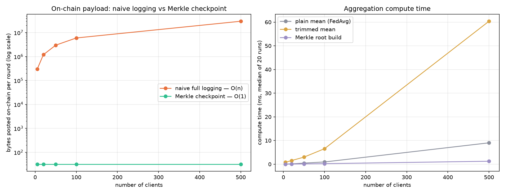
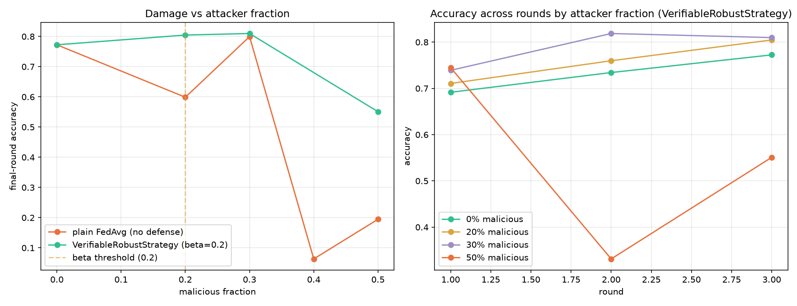

# MerkleTrim: Verifiable Robust Aggregation Engine

A Flower Strategy that defends federated aggregation against two distinct attack
types — tamper-after-commit and honest-commit-to-poisoned-data — using
commit-reveal verification and coordinate-wise trimmed mean aggregation, then
anchors each round's integrity with a 32-byte Merkle checkpoint suitable for
on-chain posting.

## Setup

```bash
pip install .
```

## Running the Baseline

```bash
flwr run . --run-config "beta=0.2 malicious-fraction=0.2"
```

This runs 10 clients (2 simulated as attackers), applies commit-reveal
verification and trimmed mean aggregation each round, and prints a ledger of
per-round Merkle roots at the end.

To reproduce the full robustness sweep (0%, 20%, 30%, 50% malicious fractions), vary `malicious-fraction` and `beta` in the command above.

## Benchmark Scripts & Results

See `_static/` for the generated benchmark charts:
- `python -m merkleTrim.benchmark_overhead` (Payload & compute time)
- `python -m merkleTrim.benchmark_robustness` (Accuracy damage curve)
- `python -m merkleTrim.test_merkle_verification` (Cross-language Python/EVM Merkle verification test)

### Overhead Benchmark


### Robustness Benchmark



## On-chain Verification Note

This baseline is fully self-contained and runs off-chain without requiring network connection or blockchain interaction. The 32-byte Merkle root output by this strategy anchors round state for optional on-chain posting and dispute protocols.