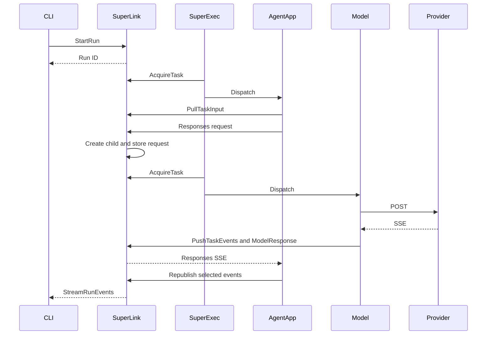

# Agent run timings

Opt-in Flower probes and a standard-library log analyzer for a later DEV capture.
This worktree contains no new live measurements or browser/BFF instrumentation.

Enable both settings on each service and worker used by the scenario:

```sh
FLWR_LOG_LEVEL=DEBUG
FLWR_RUNTIME_TIMING_LOGGING=1
```

The separate flag bounds profiling to a capture window. Configure SuperExec,
SuperLink and workers separately. Kubernetes TaskExecutor configuration accepts
both settings as literal `env` values for cold, generic warm and resident workers.
Enable the existing `log_warm_executor_output` option when capturing warm child
output in SuperExec logs. No deployment configuration has been changed here.

Markers use Flower's logger at DEBUG. AgentApp marker lines bypass task-log
upload while continuing through the current worker output relay. Warm forwarding
retains DEBUG for these lines. Verify collector visibility separately for every
route before sampling. Existing unrelated DEBUG logs can contain payloads, so
keep raw logs private and distribute only the extracted metadata table.

## Records and intervals

`runtime_timing` lines contain schema version 1 JSON with fixed stage names,
process clock domain, monotonic nanoseconds, Unix UTC nanoseconds, existing
run/task IDs, optional parent task ID, task type, FAB hash and Pod/route metadata.
Scope IDs join early boundaries to identity learned later. Span IDs pair
started/finished/failed records and include the wrapped duration and success flag.
No tokens, credentials, prompts, response bodies, provider URLs, connector data
or exception details are serialized.

`*.first_text` means the first output-text delta event, which may be empty.
Reasoning has a separate `*.first_reasoning` marker. Client
`first_text_render_requested` requires a nonempty delta and precedes appending it
to the terminal transcript. It does not measure UI paint. `stream_connect_started`
marks invocation, not connection success. `events_push_returned` means the RPC
returned, not that a subscriber received text. Runtime storage has a separate
storage-success marker.

Span `duration_ns` excludes surrounding marker writes. Marker-to-marker time
includes logging overhead. Profiling itself adds latency. Do not add nested or
concurrent spans together.



## Analyze one capture

Use logs from one deployment/environment and one capture window. Task IDs fill
missing run IDs on dispatch records. Model and Connector rows can inherit their
requesting AgentApp FAB hash for correlation. Do not mix clusters or restored databases
that may reuse task IDs. Duplicate native/forwarded records are removed.

```sh
python benchmarks/agent-run-timings/analyze.py \
  /private/tmp/superlink.log /private/tmp/superexec.log \
  /private/tmp/agent.log /private/tmp/model.log /private/tmp/client.log \
  --run-id 123 > /private/tmp/run-123.csv
```

The CSV includes identity, route, stage, start/end markers, process clock,
monotonic boundaries, duration, source, success and limitation. A run filter drops
uncorrelated idle polling. Spans require matching span ID, clock domain and stage.
StartRun-to-client milestones use the client clock and include stream connection.
Point markers and missing pairs have blank durations. Wall timestamps are never
subtracted, even for Pods on one node.

Routing requires successful warm token acknowledgement or cold Pod creation.
Exact warm uses the selected FAB-specific pool. Reservation alone is insufficient.
Dispatch acceptance does not prove execution success. Check Pod metadata,
`agent.preloaded` for exact workers, completed run status and actual client text.
Failed warm attempts and cold fallback retain separate stage and Pod records.

## Validation and next capture

From `framework/`, use the framework environment with Python 3.11.14:

```sh
PYTHONPATH=py python -m pytest py/flwr/supercore/runtime_timing_test.py \
  ../benchmarks/agent-run-timings/analyze_test.py
```

The in-process smoke test uses real in-memory state, Responses HTTP routing,
atomic acquisition, provider SSE parsing, persistence, AgentApp publication,
Control streaming and CLI rendering. Provider I/O and transport adapters are
fakes. Focused tests also cover DEBUG gating, failed spans, redaction, bounded
first-event markers, task-log exclusion, resident-worker relay and clock-safe
analysis. These checks do not establish DEV collection or Kubernetes scheduling.

For DEV, record deployed image SHA, FAB hash, federation, model, region, profiling
settings, claimed Pod and route. Use the same scenario for repeated samples,
include warmups and report raw samples, median and spread. Use `flwr chat` with
`/load` for the disposable profiler app; `flwr run` does not supply this path's
prompt. Keep these gaps explicit when rebuilding the icicle:

| Interval | Evidence or remaining limitation |
| --- | --- |
| StartRun to first client event/text/end | Same-client monotonic interval |
| Control preparation and run creation | Service-local stages and boundaries |
| Reconcile, capacity, acquisition and launch | SuperExec-local spans |
| Warm exec/token/ack or cold Pod creation | Dispatch-local spans with Pod identity |
| Agent input/session/FAB/dependencies/import/user code | Worker-local spans |
| Model request/provider POST/first SSE/text/event push | Worker-local spans |
| Cross-process network/dispatch/delivery gaps | Unresolved without a clock bound or skew estimate |
| Kubernetes scheduling/image pull/process import before input | Requires Pod events or startup probes |
| Browser auth/BFF/UI paint | Requires a separate Labs/browser scenario |
| Provider-internal queueing | Opaque without provider telemetry |
| Connector round | Not exercised by this smoke scenario |

Preserve unresolved icicle boxes until a correlated, completed DEV capture exists.
